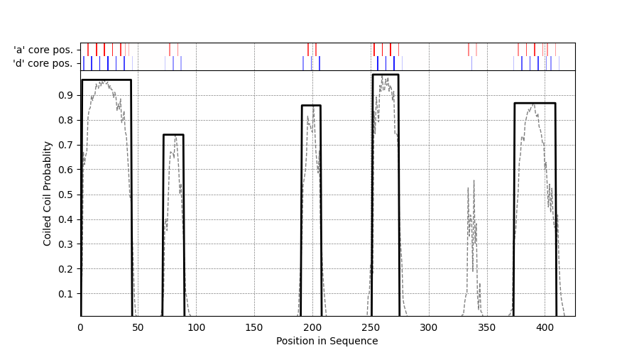

# **DeepCoil** #
[](https://doi.org/10.1093/bioinformatics/bty1062 )
 

## **Fast and accurate prediction of coiled coil domains in protein sequences**
### **New in version 2.0** ###
- Retrained with the updated dataset based on *[SamCC-Turbo](https://github.com/labstructbioinf/samcc_turbo)* labels.
- Faster inference time by applying *[SeqVec](https://github.com/rostlab/SeqVec)* embeddings instead of *psiblast* profiles.
- Heptad register prediction (*a* and *d* core positions).
- No maximum sequence length limit.
- Convenient interface for using *DeepCoil* within python scripts.
- Automated peak detection for improved output readability.
- Simplified installation with *pip*.

**Older DeepCoil versions are available [here](https://github.com/labstructbioinf/DeepCoil/releases).**

### **Requirements and installation** ###
DeepCoil requires `python>=3.6.1` and `pip>=19.0`. Other requirements are specified in the `requirements.txt` file.

The most convenient way to install **DeepCoil** is to use pip:
```bash
$ pip3 install deepcoil
```

### **Usage** ###

#### Running DeepCoil standalone version:

```bash
deepcoil [-h] -i FILE [-out_path DIR] [-n_cpu NCPU] [--gpu] [--plot]
                [--dpi DPI]
```
| Argument        | Description |
|:-------------:|-------------|
| **`-i`** | Input file in FASTA format. Can contain multiple entries. |
| **`-out_path`** | Directory where the predictions are saved. For each entry in the input file one file will be saved. Defaults to the current directory if not specified.|
| **`-n_cpu`** | Number of CPUs to use in the prediction. By the default all cores will be used.|
| **`--gpu`** | Flag for turning on the GPU usage. Allows faster inference on large datasets. Overrides **`-n_cpu`** option.|
| **`--plot`** | Turns on the additional visual output of the predictions for each entry in the input. Plot files are saved in the **`-out_path`** directory.|
| **`--dpi`** | DPI of the saved plots, active only with **`--plot`** option.|

In a rare case of `deepcoil` being not available in your `PATH` after installation please look in the `$HOME/.local/bin/` or other system specific `pip` directory.

Description of columns in output file:
- **`aa`** - amino acid in the input protein sequence
- **`cc`** - sharpened coiled coil propensity
- **`raw_cc`** - raw coiled coil propensity
- **`prob_a`** - probability of *a* core position
- **`prob_d`** - probability of *d* core position

#### Running DeepCoil within script:

```python
from deepcoil import DeepCoil
from deepcoil.utils import plot_preds
from Bio import SeqIO

dc = DeepCoil(use_gpu=True)

inp = {str(entry.id): str(entry.seq) for entry in SeqIO.parse('example/example.fas', 'fasta')}

results = dc.predict(inp)

plot_preds(results['3WPA_1'], out_file='example/example.png')
```
`results[entry]`  for an entry of sequence length `N` contains two keys:
- `['cc']` - per residue coiled coil propensity (`[N, 1]` shape)
- `['hept']` - per residue core positions (`[N, 3]` shape, order in the second axis is: no/other position, *a* position, *d* position)

Peak detection can be performed with the `deepcoil.utils.sharpen_preds` helper function.
#### Example graphical output:

